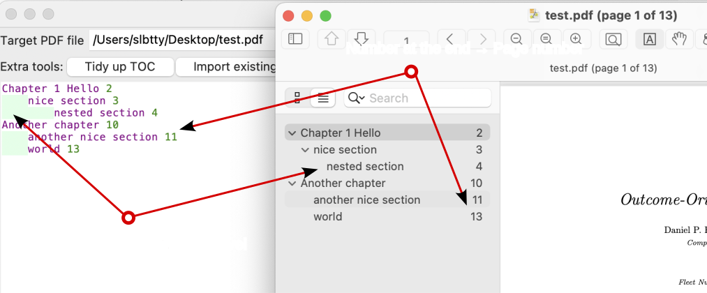

# Mini PDF Outline Editor

```
pipx run pdf-outline-edit     # tk GUI
pipx run pdf-outline-edit[qt] # qt GUI, does not work yet
```

A GUI program to import, edit and modify PDF outlines/Table-of-Content through a simple textual format.

The textual format is almost the same as printed books' ToC which has been "rediscovered" multiple times.

1. Indent level -> Nesting level
2. Number at the end -> Page number
3. Text in between -> Title

You can copy and paste existing outline from PDF books and tidy it up a bit to fuse it into the PDF file in 3 easy steps:

1. Set a target PDF file
2. Write the outline
3. Press "Write to PDF" button



## Extra 

### Auto tidy-up

1. Remove excessive spaces
2. Remove ending punctuations (`,.`) in titles
3. ?

### Auto indent by heads

Try convert

```
index 1
1 Chapter one 2
1.1 nice 3
1.2 world 4
2 Chapter two 5
2.1 hello 6
2.2 noice 7
references 8
```

into


```
index 1
1 Chapter one
    1.1 nice
    1.2 world
2 Chapter two
    2.1 hello
    2.2 noice
    references 8  <--- this needs to adjust final entries that has no chapters
```

Extra Options

* Offset: Starting page of the page numbers. The pages before it will be roman numerals and the offset page's page label will be 1.

# Alternatives

* [HandyOutliner](https://handyoutlinerfo.sourceforge.net/) Almost identical program but written in .NET & iText and uses XML
* [pdf.tocgen](https://github.com/Krasjet/pdf.tocgen) Over-engineered by following the disgusting "unix philo-dogshit-sophy".

# DevOops

```sh
# Install in virtualenv
python3 -m pip install -e .
python3 -m pip install -e .[qt]

# Run in dev environment
./src/run-gui.py
```

# License

AGPL-3.0-or-later

# FYI

Python packaging is HOLY HELL.